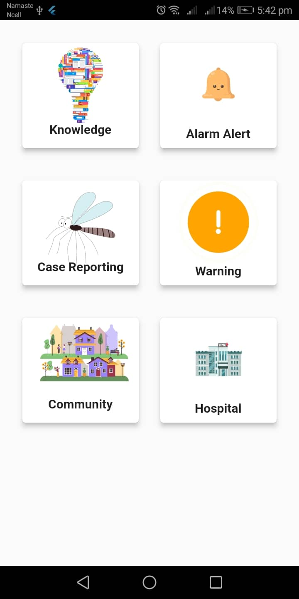

# Dengue

A dengue app design with the help of Provider State Management (RiverPod).

## Getting Started

Dengue is built in order to aware about the dengue and also to collect the data of risk area of dengue. It also provide the knowledge about prvention from the dengue . It also has the notification system to notify every people to clean the place around them. Has also the Google map implementation to get the exact location to find the dengue risky area. It has admin dashboard to control all the things of the app like Event, campaign, faq section, to check symptoms and notification .

## ScreenShots:

